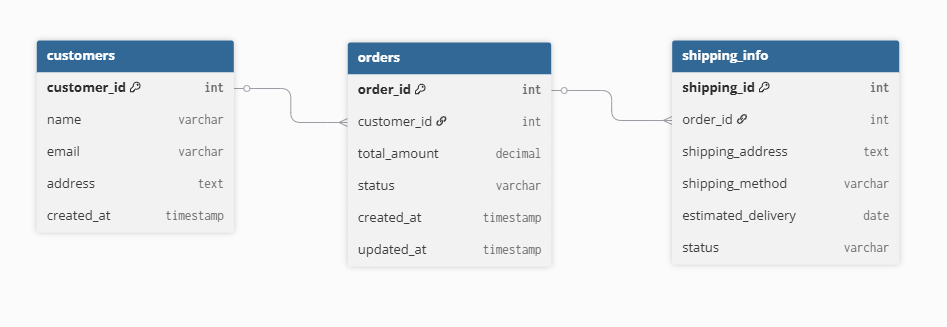

# 🛢️⚙️ StreamSync Database Engine

**StreamSync DB Engine** is a real-time Change Data Capture (CDC) system that synchronizes data across MySQL, Redis, and MongoDB. It captures database changes using Debezium, streams them via Kafka, and processes them using Apache Spark Structured Streaming for real-time updates.

🚧 **This project is still under active development. Features and structure may change.**

## 📖 Table of Contents

1. [📌 Project Overview](#project-overview)
2. [🧬 Data Flow Architecture](#data-flow-architecture)
3. [📁 Project Folder Structure](#-project-folder-structure)
4. [🧪 Get Started](#-get-started)
5. [ℹ️ Note](#note)

## 📌 Project Overview

This project enables real-time synchronization of structured data across systems by leveraging Debezium for CDC, Kafka for message streaming, and Spark for stream processing. The transformed data is written to Redis (for fast read access) and MongoDB (for flexible document storage).

### 🔧 Key Features:

- Real-time CDC with insert, update, delete operations
- Event-driven processing using Spark Structured Streaming
- Support for Redis and MongoDB as sync targets
- Efficient ID-based deduplication with Redis
- Modular and extensible architecture

### 📦 Tech Stack

- **Language**: Python 3.9.7
- **Stream Processing**: Apache Spark 3.5.6 (Structure Streaming)
- **Stream Transport**: Apache Kafka
- **Change Capture**: Debezium (MySQL connector)
- **Database**: MySQL, MongoDB, Redis
- **Containerization**: Docker

## 🧬 Data Flow Architecture


<p align="center">
    <em>Data Flow Architecture</em>
</p>

## 📁 Project Folder Structure

```bash
    streamsync-db-engine/
    │
    ├── config/
    │   ├── env_config.py
    │   ├── mysql.cnf.py
    │   └── debezium-connector.json     # Debezium MySQL connector config
    ├── scripts/
    │   ├── init_data.py                # Create sample data by faker
    │   ├── init_schema.py              # Create MySQL db and tables
    │   └── spark_consumer.py           # Main streaming job
    │
    ├── sql/
    │   └── create_tables.sql           # MySQL schema
    │
    ├── .env                            # Environment variables (ports, credentials, topic, etc.)
    ├── .gitignore
    ├── docker-compose.yml              # Define Kafka, Redis, Mongo, MySQL, Debezium
    ├── requirements.txt
    └── README.md
```

## 🧪 Get Started

1.  **Clone the repository**:

    ```bash
    git clone https://github.com/rooniac/streamsync-db-engine.git
    cd streamsync-db-engine
    ```

2.  **Install dependencies**:

    ```bash
    python -m venv venv
    source venv/bin/activate  # Windows: venv\Scripts\activate
    pip install -r requirements.txt
    ```

3.  **Setup `.env` file**:

    Create `.env` base on your infomation that you set in docker (MySQL, Redis, MongoDB, Kafka ...)

4.  **Run docker compose**:

    Before run docker-compose.yaml, you have to create `mysql.cnf` file in config folder with this sample content:

    ```bash
    [mysqld]
    server-id=1
    log_bin=mysql-bin
    binlog_format=ROW
    binlog_do_db=ecommerce
    ```

    If you place it in another folder, make sure you change the file path in `docker-compose.yaml`. After that, you can run docker compose.

    ```bash
    docker-compose up -d
    ```

5.  **Create MySQL database**:

    ```bash
    python scripts/init_schema.py
    ```

    Sample schema is used in project:

    

    <p align="center">
        <em>MySQL schema</em>
    </p>

6.  **Register CDC connect with MySQL**:

    ```bash
    curl -X POST http://localhost:8083/connectors ^
    -H "Content-Type: application/json" ^
    -d "@config\debezium-connector.json"
    ```

7.  **Start Spark Streaming Consumer**

    ```bash
    spark-submit scripts/spark_consumer.py
    ```

    After this, the system is streaming data from MySQL to MongoDB and Redis by CDC. You can insert, update, or delete records in the customers, orders, or shipping_info tables in MySQL, and the changes will automatically propagate in near real-time:

    - In Redis: You will immediately see the updated or inserted JSON documents stored using the primary key as Redis key.
    - In MongoDB: The upserted documents will be written into the corresponding collections (customers, orders, shipping_info).

8.  **Insert mock data with faker (Optional)**

    You can use init_data.py file to insert mock data using Python Faker. You can also use parser to define number of customer and orders.

    ```bash
    python scripts/init_data.py --customers 10 --orders 100
    ```

## ℹ️ Note

You can monitor logs from the Spark job to verify that CDC events are being captured and processed correctly. In case no log appears, ensure that:

- All docker container are running.
- Kafka contains CDC events.
- The process_stream function is running without error.
- MySQL binlog format is ROW and binary logging is enabled.
